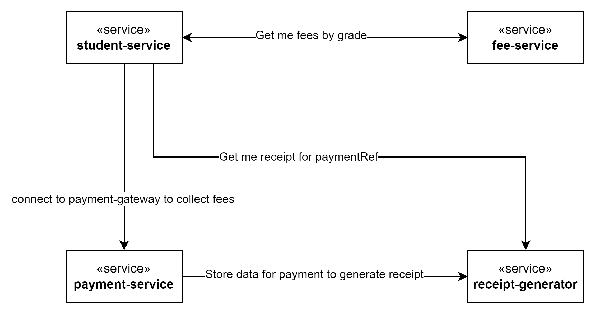

# Skiply : A student management and fees collection platform

### Architecture


### Database schema
Work in progress

### Repo Details
There are two parts of this repo <br />
1. api-code : which contains APIs nad models that can be used by other dependent service instead of recreating those again <br />
2. services: which contains microservices <br />


### Services
Application has been split into 4 services that manages separate functionalities <br />
 1. student-service: this take care of student enroll, pending fees, initiating a payment <br />
 2. fee-service: a static service which contains list of applicable fees <br />
 3. payment-service: this service communicate to payment-gateway to collect payment <br />
 4. receipt-generator: this is to generate receipts as we need <br />

### Getting started
1. Generate api-code using below command <br />
    GoTo api-code folder and Execute <br />
 ``` mvn clean install ``` <br />
 This will generate all api-code <br />
2. Build all service <br/>
    Goto services folder and Execute <br/>
   ``` mvn clean install ``` <br />
3. Now we have to go into individual service and run (if running via command prompt we need to open 4 different command prompt windows ) 
    ``` mvn spring-boot:run ```

### Postman Collection
Go to docs folder for postman collection

### How to test
1. Start all services
2. Enroll a student using http://localhost:8081/student
3. Get pending fees for student created using http://localhost:8081/student/PLN1249/fee:pending <replace PLN1249 with studenId>
4. Initiate payment using http://localhost:8081/student/PLN1249/fee:payment <replace PLN1249 with studenId>
5. We can check payment status using http://localhost:8082/payment/vBymOjsIYO:status <payment reference can be picked from step 4 output>
6. Receipt can be fetched using
    http://localhost:8083/receipt/VrqUHMuULg <from receipt-generator>
    http://localhost:8081/student/PLN1249/payment/VrqUHMuULg/fee:receipt <from student-service>

### Future scope
1. Instead of adding values in postman collection we can use postman env variable to set values at the runtime
2. In payment-service we can use State Design pattern to maintain state for the payment
